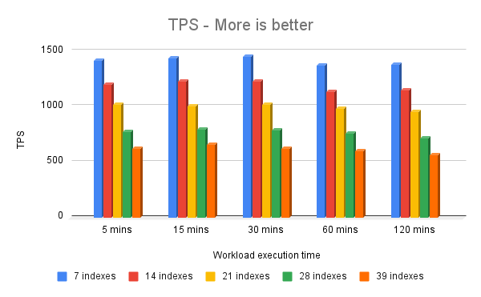
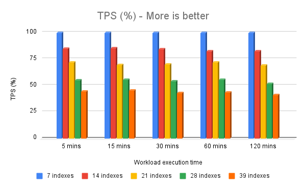
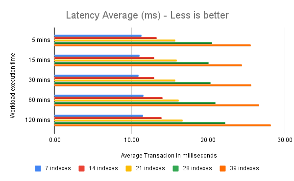
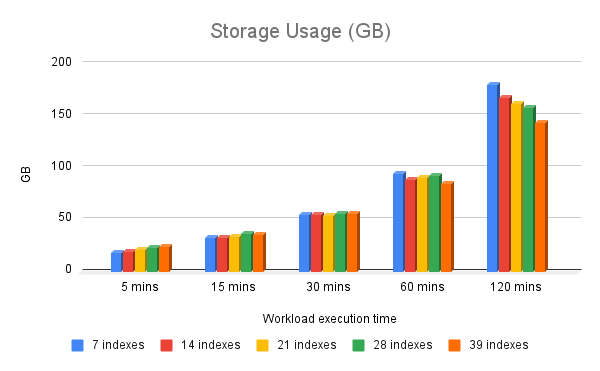
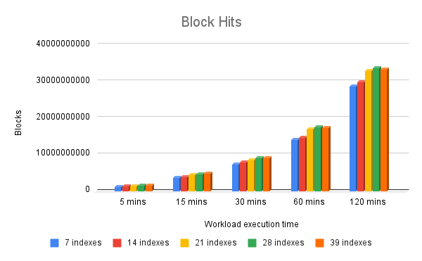
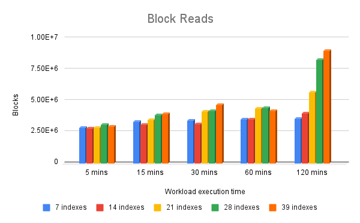
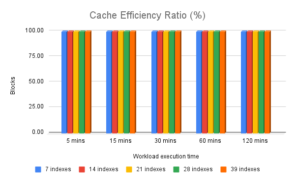
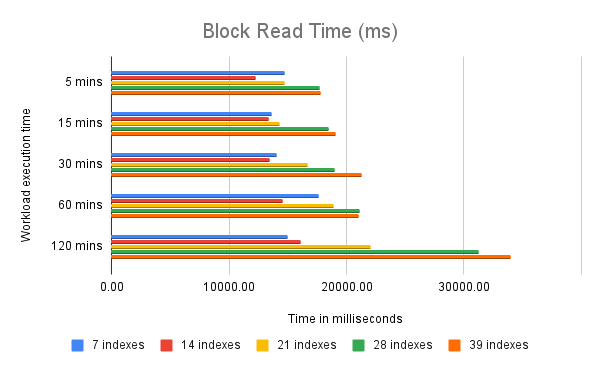
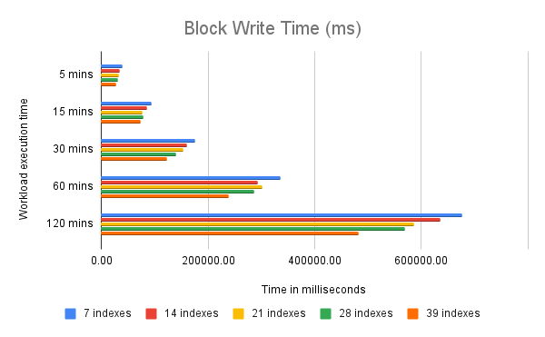

# postgresql_benchmarking_overindexing
This repository contains a collection of scripts designed to create a data schema that is a bit more realistic than the default pgbench schema. It includes multiple tables with various data types, indexes, and check constraints. The repository also provides scripts for initial data population and a custom script that can be used through pgbench (taking advantage of its built-in concurrency capabilities).

The goal is to simulate a pseudo-realistic workload; something different from the default pgbench workload, which relies on small tables populated with integer-only data, and to assess the performance impact of overindexing in a controlled and reproducible environment.

This benchmark does **NOT** aim to evaluate PostgreSQL's transactional capabilities, nor is it intended to discourage the use of indexes that can provide performance benefits to the application. The advantages of indexing are well known and extensively documented.

Instead, the purpose of this benchmark is to demonstrate the negative impact of overindexing or holding **UNUSED** indexes during data modification operations (INSERT, UPDATE, DELETE). These **UNUSED** indexes provide no benefits, and also introduce measurable performance degradation.

You may be interested in tools like [pg_gather](https://github.com/jobinau/pg_gather) for quickly identifying unused indexes. These unused indexes can be considered candidates for removal, provided they are not required to enforce uniqueness (e.g., primary or unique constraints).

## Benchmark environment specs

### Hardware specs
```bash
$ sudo dmidecode -s system-manufacturer
Dell Inc.
$
$ sudo dmidecode -s system-product-name
PowerEdge C6525
$
$ lscpu | awk '
/^Architecture:/ {show1=18; print; next}
show1 > 0 {print; show1--; next}
/^[Ll][123][a-z]* cache:/ {print}
'
Architecture:                       x86_64
CPU op-mode(s):                     32-bit, 64-bit
Address sizes:                      43 bits physical, 48 bits virtual
Byte Order:                         Little Endian
CPU(s):                             128
On-line CPU(s) list:                0-127
Vendor ID:                          AuthenticAMD
Model name:                         AMD EPYC 7452 32-Core Processor
CPU family:                         23
Model:                              49
Thread(s) per core:                 2
Core(s) per socket:                 32
Socket(s):                          2
Stepping:                           0
Frequency boost:                    enabled
CPU(s) scaling MHz:                 100%
CPU max MHz:                        2350.0000
CPU min MHz:                        1500.0000
BogoMIPS:                           4691.24
L1d cache:                          2 MiB (64 instances)
L1i cache:                          2 MiB (64 instances)
L2 cache:                           32 MiB (64 instances)
L3 cache:                           256 MiB (16 instances)
$
$ sudo dmidecode --type memory | awk '
/^\s*Size:/ && $2 ~ /^[0-9]+$/ {
    total += $2
    count++
}
/^\s*Speed:/ { speed[$0]++ }
/^\s*Type:/ { type[$0]++ }
END {
    printf("Total memory: %.0f GB in %d modules\n\n", total, count)
    print "=== Memory types ==="
    for (t in type) print type[t], "-", t
    print "\n=== Memory speeds ==="
    for (s in speed) print speed[s], "-", s
}
'
Total memory: 1024 GB in 16 modules

=== Memory types ===
16 -  Type: DDR4

=== Memory speeds ===
16 -  Speed: 3200 MT/s
$
```
### OS specs
```bash
$ hostnamectl | grep "Operating System"
Operating System: Oracle Linux Server 9.4
$
```
## How to Use

### 1. Install PostgreSQL
Install the PostgreSQL version of your choice. You can follow the installation procedure detailed on https://www.postgresql.org/download/.
My benchmark was performed using PostgreSQL version 17. Given the available hardware resources and the benchmark's needs, PostgreSQL was configured according to the settings included in the [postgresql.auto.conf](postgresql.auto.conf) file.

### 2. Build your database schema
Build the database schema by using the [pgbench_custom_schema.sql](pgbench_custom_schema.sql) file.
```bash
psql -d pgbench -f pgbench_custom_schema.sql
```

### 3. Populate your database schema
Populate your database schema by using the [pgbench_schema_initial_data_load.sql](pgbench_schema_initial_data_load.sql) file.
```bash
psql -d pgbench -f pgbench_schema_initial_data_load.sql
```
#### Considerations
Once the data schema has been loaded with the dataset, you may consider running a `pg_dump` to produce an exact copy of the data.
This dump can be used to quickly and reliably recreate the database between test runs, ensuring that each execution is performed not only with the same data volume but with identical data contents.
```bash
pg_dump -U postgres -d pgbench -F c --clean -C -f dump_pgbench_metadata.dump
```

### 4. Performing pgbench
You can now run `pgbench` using the custom script [pgbench_tpc-b_custom_load.sql](pgbench_tpc-b_custom_load.sql).
You may adjust the execution conditions and concurrency levels according to your needs by modifying the `pgbench` parameters.
For more information, refer to the official `pgbench` documentation: https://www.postgresql.org/docs/17/pgbench.html
```bash
nohup /usr/pgsql-17/bin/pgbench -U postgres -d pgbench -f pgbench_tpc-b_custom_load.sql -T 300 -c 16 -j 8 --no-vacuum &
```
#### Considerations
It is recommended to run the benchmark using `nohup` to ensure that the execution and its statistics persist in case you lose connectivity with your terminal session.
The `pgbench` execution data will be available in the `nohup.out` file once the execution completes.
In addition to the `pgbench` statistics, you can obtain additional information about input/output load (to memory and underlying storage) using the following query:
```sql
SELECT xact_commit,
       blks_read,
       blks_hit,
       blk_read_time,
       blk_write_time
FROM   pg_stat_database
WHERE  datname = 'pgbench'; 
```
### 5. Adding indexes for comparison
Once the initial test round has been completed, you may be interested in running additional test rounds with more indexes.
This repository includes the scripts [adding_7_indexes.sql](adding_7_indexes.sql), [adding_14_indexes.sql](adding_14_indexes.sql), [adding_21_indexes.sql](adding_21_indexes.sql), and [adding_32_indexes.sql](adding_32_indexes.sql).
These indexes can be added on top of the original schema, which already includes seven initial indexes.
The recommended steps to refresh the environment and run new tests are as follows:
```bash
# Recreate your database from previous dump
pg_restore -U postgres -d postgres -j 4 --clean --if-exists dump_pgbench_metadata.dump
# Use the adding_#_indexes.sql scripts to add additional indexes to the schema
psql -f create_14_indexes.sql pgbench
# Clean the bgwriter metrics
psql -c "SELECT pg_stat_reset_shared('bgwriter')"
# Remove any cache at OS and DB level (as OS superuser / root)
systemctl stop postgresql-17
echo 3 > /proc/sys/vm/drop_caches
systemctl start postgresql-17
# Run the benchmark one more time
nohup /usr/pgsql-17/bin/pgbench -U postgres -d pgbench -f pgbench_tpc-b_custom_load.sql -T 300 -c 16 -j 8 --no-vacuum &
```
## Results from my own test









